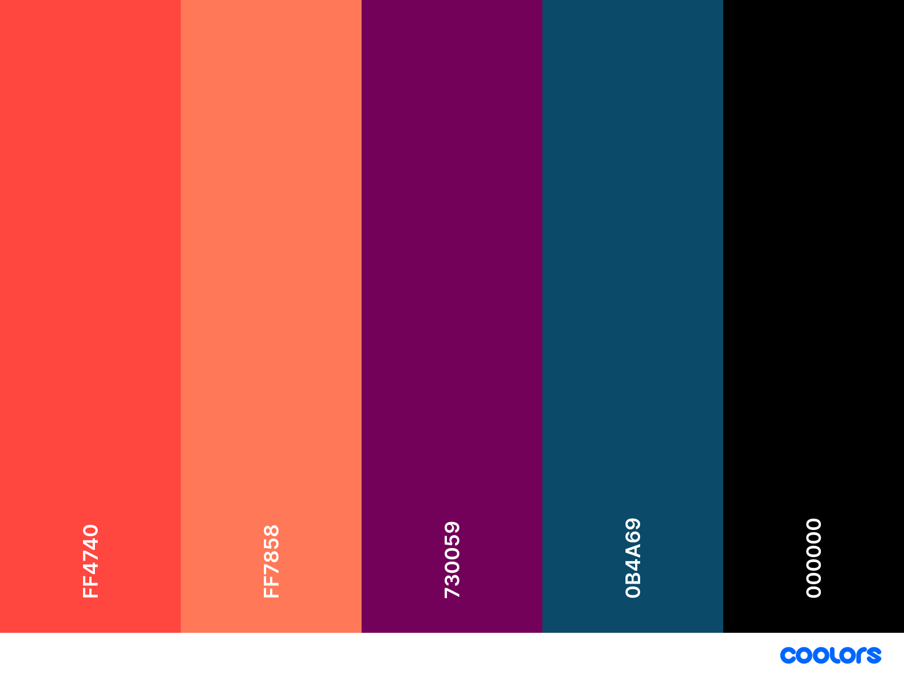

# Front-end

With Do I Code, you can achieve better insight into the progress you've made inside of GitHub repositories using easy-to-understand visualisations. To get started, simply login with a GitHub account and choose a repository.

This is the fron-endcomponent of the Do I Code application, which makes use of Next.js. Currently, the only supported language in the user-interface is Dutch. While this component can function on its own, other components are required to make use of all the functionality Do I Code gets to offer.

## Setup
This application requires you to register a GitHub OAuth application. Create an OAuth application in your GitHub account or organization and set `Authorization callback URL` to `http://localhost:3000/api/auth/callback/github`. If you plan to use the application outside of a local development environment, replace `http://localhost:3000` accordingly.

To run the application locally, you will need to have Node.js and the NPM package manager installed. You can initialize a Node.js as usual by cloning the repository and running `npm install` inside of it. To start the application (with development and debugging tools), run `npm run dev`.

## Design Guidelines
A few design guidelines have been divised to improve the consistency or the interface of the application. Please adhere to these guidelines when developing the interface and update them when necessary.

### Font
The font has yet to be determined.

### Color Palette

## Issues
When reporting issues, please be as descriptive as possible.