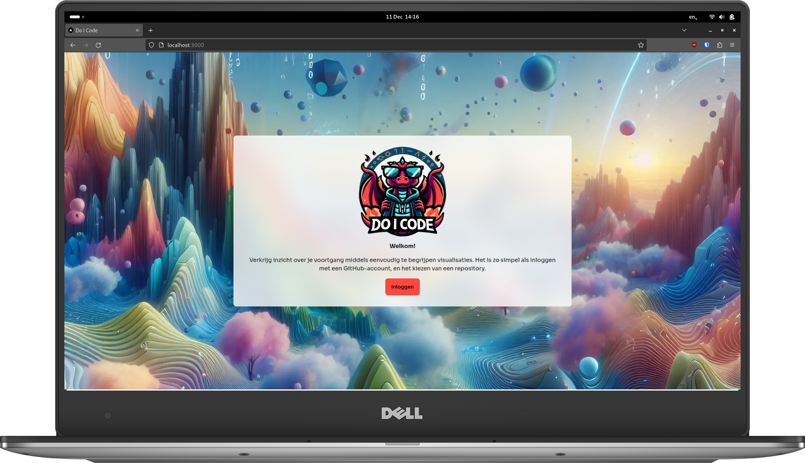

# Front-end
<br>
<br>
You can [give Do I Code a try](https://do-i-code.com) in your browser right now!

With Do I Code, you can achieve better insight into the progress you've made inside of GitHub repositories using easy-to-understand visualisations. To get started, simply login with a GitHub account and choose a repository.

This is the front-endcomponent of the Do I Code application, which makes use of Next.js. Currently, the only supported language in the user-interface is Dutch.

## Setup
This application requires you to register a GitHub OAuth application. Create an OAuth application in your GitHub account or organization and set `Authorization callback URL` to `http://localhost:3000/api/auth/callback/github`. If you plan to use the application outside of a local development environment, replace `http://localhost:3000` accordingly. It can be useful to create seperate OAuth applications for development and production, as GitHub only allows one authorization callback URL per app.

To run the application locally, you will need to have Node.js and the NPM package manager installed. You can initialize a Node.js as usual by cloning the repository and running `npm install` inside of it. To start the application (with development and debugging tools), run `npm run dev`.

### Configure `.env.local` File
In order to run the application, you need to create a `.env.local` file in the root of the project containing environment variables. The following environment variables will need to be configured appropriately.

```
GITHUB_CLIENT_ID='' # provided when creating an oauth app with github
GITHUB_CLIENT_SECRET='' # provided when creating an oauth app with github
NEXTAUTH_SECRET='' # run to generate: openssl rand -base64 32
```

### Configure backend endpoint
While this application can function on its own, it is possible to relay repository and issue information to a backend component. This means that every time the application fetches this data from GitHub, it will also send this data to a given endpoint. To enable this functionality, add the following environment variable to your `.env.local` file.

```
BACKEND_ENDPOINT='https://example.com/api/put'
```

When this environment variable is defined, JSON data will be sent to this endpoint using PUT requests. An example is provided below.

```json
{
  "repository": {
    ...
  },
  "issues": [
    {
      ...
    },
    ...
  ]
}
```

The contents of `repository` is equal to the result of the [`/repos/{owner}/{repo}` GitHub REST API endpoint](https://docs.github.com/en/rest/repos/repos?apiVersion=2022-11-28#get-a-repository), whereas the contents of `issues` is equal to the result of the [`/repos/{owner}/{repo}/issues` GitHub REST API endpoint](https://docs.github.com/en/rest/issues/issues?apiVersion=2022-11-28#list-repository-issues).

## Design Guidelines
<br>
<br>
A few design guidelines have been divised to improve the consistency or the interface of the application. Please adhere to these guidelines when developing the interface and update them when necessary.

### Font
The application makes use of the "Sora" font, designed by Jonathan Barnbrook and Julián Moncada. More information can be found on [Google Fonts](https://fonts.google.com/specimen/Sora).

### Color Palette
[](./public/palette.pdf)

## Responsibility Disclosure
The logo and the various backgrounds that can be found in this project were created with the help of AI, and serve mostly as a placeholder. Please refrain from using this media in a commercial context. The particular files are as follows.

- `/public/logo.png`
- `/public/logo-alt.png`
- `/public/logo-crop.png`
- `/public/background-1.png`
- `/public/background-2.png`
- `/public/background-3.png`
- `/public/background-4.png`
- `/public/background-5.png`
- `/public/mockup-desktop.png` (contains `/public/logo.png` and `/public/background-1`)
- `/public/mockup-mobile.png` (contains `/public/logo.png` and `/public/background-1`)


## Issues
When reporting issues, please be as descriptive as possible.